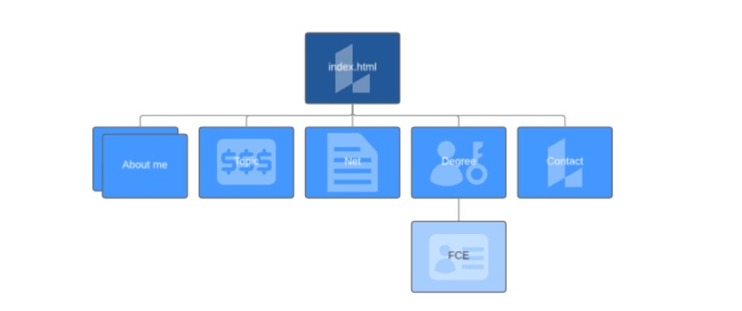
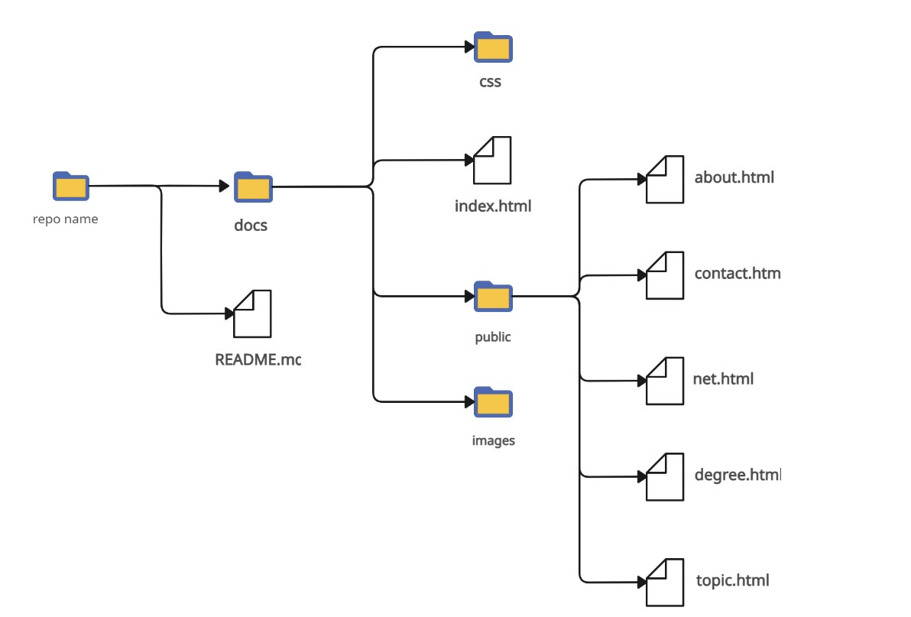

# practical_work_II
PROJECT OBJECTIVES
- To demonstrate an efficient and profifient use of html for structuring the page and CSS for styling the pages.
- To develop and design a website with various web pages following this structure

- The html files and CSS file, with all images are organized in this structure

PROJECT DESCRIPTION
- The project consitsts of a wepsite composed of various webpages developed with html with the functionality and with CSS for the decoration and stilization of the page. 
- In each page there are various things: 
- In the first one, there is the home page, with a redirection to the rest of the pages
- We have a degree page, in which all subjects covered in the degree are explained (except FCE). 
- The FCE subject is explained more in detail in another page, the fce.html file, in which you can see everything we learnt from the history of comupter engineering from the start to the point we are right now, as well as learning how to use gitHub for projects and and learning a bit about web development with html and CSS.
- In the about page, you will learn a bit more about me, my personal ambitions and goals.
- In the topic page, you will find a brief article about phishing, its history and its impact nowadays.
- In the contact page, you will be able to contact me and write anything taht you want me to know.
- In the net site, you will be able to see other colleague's websites and yo con visit them as well.

CHALLENGES I FOUND

- During the project, I found various difficulties I had to deal with, such as finding some really silly mistakes I had made in the code (which took a lot of time to fix)
- Another challenge I had to deal with was that I made for each hmtl file, its own styles.css file. Being the main problem at the end when merging all of them into one only file.

- Another thing I found was hot to call the styles.css file in deeper html files (the ones in the pusblic folder), until I realized i has ot put a ../ before the location of the folder to find it.

OTHER DETAILS

- I used github to be able to save the work while I did ir so not to lose it in case something happened, making commits every time a change was made.

CONCLUSSIONS:
- The proyect taught me that web development is not that easy and that to develop a web, you need a lot of hours of work and dedication, specially for the CSS files.
- Also, I found out that I stayed more time fixing errors and mistakes thank coding on itself.
- But my final conclussion is that despite the dedicated hours to do this, I have been able to test out the skills and things learnt during de FCE class, being able to use efficiently CSS and html.